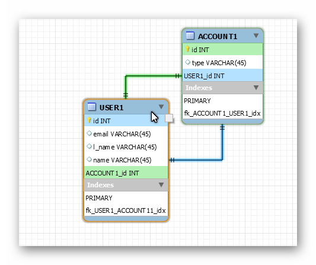
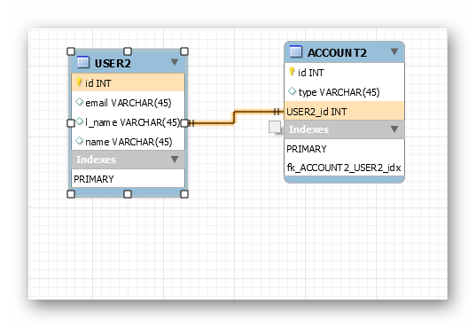
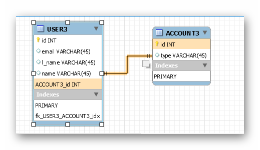
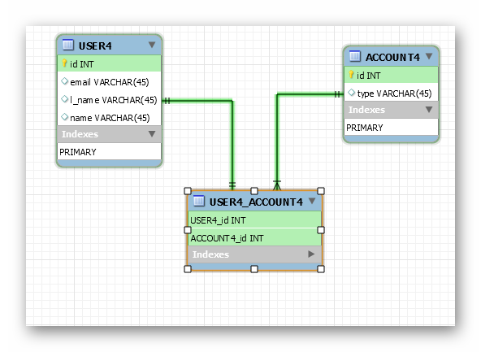
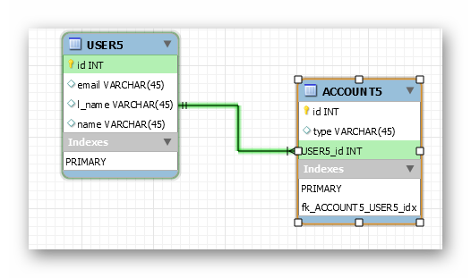
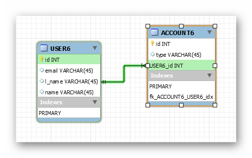
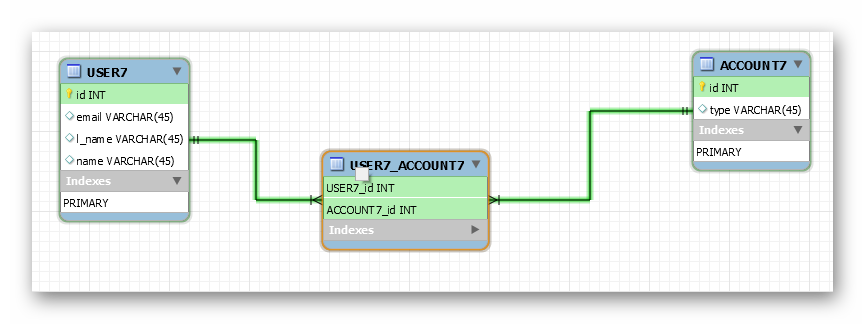
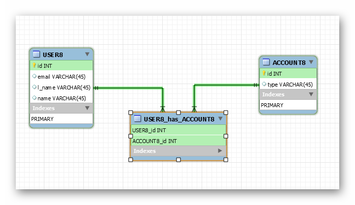

# JPA ASSOCIATIONS

This project was created for showing different association mappings using jpa annotations

package names show type of relations

<a href = "mailto: szxhigh@gmail.com">Send Email To Developer</a>
